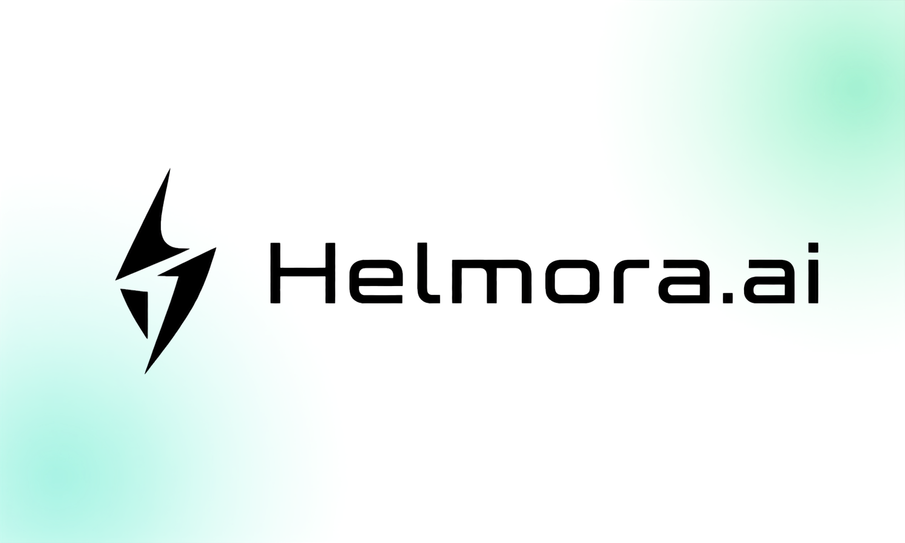

<p align="center">
  
</p>

# Helmora-Web v2

<p align="center">
  <a href="#known-limitations"></a>
  <a href="package.json">= 22.13" src="https://img.shields.io/badge/Node.js-%3E%3D22.13-339933?style=flat-square&logo=nodedotjs&logoColor=white"></a>
  <a href="https://react.dev/"></a>
  <a href="https://vite.dev/"></a>
  <a href="LICENSE"></a>
  <a href="https://github.com/Helmora-AI/HelmoraAI-Web/commits"></a>
</p>

<p align="center">
  <a href="https://github.com/Helmora-AI/HelmoraAI-Hub-v2"><strong>Helmora Hub</strong></a>
  ·
  <a href="https://github.com/Helmora-AI/HelmoraAI-Web"><strong>Helmora Web</strong></a>
</p>

Chat workspace and operations console for Helmora-Hub. The Web application
uses only the Hub's public HTTP contract: it does not import backend internals,
read SQLite or the credential vault, or retain setup tokens, API keys,
passwords or provider secrets in browser storage.

> **Status:** `2.0.0-alpha.1` — functional alpha with responsive and browser
> coverage across the primary workflows. It is not yet production-proven.

## Repository pair

| Repository | Role |
| --- | --- |
| [Helmora-AI/HelmoraAI-Web](https://github.com/Helmora-AI/HelmoraAI-Web) | This repository: chat workspace and operations console |
| [Helmora-AI/HelmoraAI-Hub-v2](https://github.com/Helmora-AI/HelmoraAI-Hub-v2) | Required gateway, orchestration, storage, security and management API |

Web always connects to a compatible Helmora-Hub through its public HTTP
contract. It can run as a separate service, or its production build can be
placed in `Helmora-Hub/dist/web` so Hub serves both UI and API from one process
and one origin.

## Available surfaces

| Group | Surface |
| --- | --- |
| Auth | first-run setup, one-time API-key receipt, login, session, logout, CSRF |
| Work | direct Responses SSE chat, native agent/memory chat, conversations, research, tools |
| Operate | overview, provider connections, Models & routes, durable tasks |
| Knowledge | memories, files, knowledge bases/documents/search |
| System | scoped API keys, usage/request inspector, audit, runtime/OpenAPI, webhooks |

Highlights:

- Streaming Chat supports stop/abort, sanitized Markdown, code copy,
  direct/native modes and source links validated by Hub.
- Conversations support search, rename, archive/restore, fork, export and
  delete.
- Provider cards expose Active, Coming Soon and Blocked catalog states plus
  Ready/Attention operational state. Configure supports Save, Save & Verify,
  Diagnose and Import.
- Models & routes includes Diagnose quick-add, search/filter, metadata editing
  with locked identity fields, Enable/Disable, hard Delete and route
  simulation.
- Provider forms are driven by Hub `config_fields`; multi-connection state is
  isolated to the selected connection.
- Light, dark and system themes, responsive navigation, lazy-loaded
  routes/charts and reduced-motion handling are included.

## Requirements

- Node.js `>=22.13.0` (Node.js 24 recommended)
- a compatible Helmora-Hub at `http://127.0.0.1:3000` or another configured
  origin

## Local development

From the `Helmora-Web` directory:

```powershell
npm.cmd ci
npm.cmd run dev
```

Open `http://127.0.0.1:5173`. Vite reverse-proxies Hub API, cookies and SSE so
the browser always communicates through one origin.

To develop against the backend, run a compatible Helmora-Hub checkout at
`127.0.0.1:3000`, then start Web as shown above. Installation, type checking,
unit tests and production builds in this repository do not depend on a parent
npm workspace or files outside this directory.

## All-in-one integration

Helmora-Hub can serve the Web production build directly. After building both
repositories, copy the contents of `Helmora-Web/dist/` into
`Helmora-Hub/dist/web/`:

```powershell
Copy-Item -Recurse -Force .\dist\* <path-to-Helmora-Hub>\dist\web\
```

Hub then serves UI and API from the same origin with CSP, cache policy, path
containment and SPA fallback that does not mask `/api`, `/v1`, `/mcp`, health
or file errors. `HELMORA_WEB_DIR` may point Hub to another valid Web build.

The all-in-one layout requires only the Hub process at runtime; a separate Web
server is not needed.

## Production Web-only

From the `Helmora-Web` directory:

```powershell
npm.cmd ci
Copy-Item .env.example .env
npm.cmd run build
npm.cmd start
```

Default `.env`:

```dotenv
HELMORA_WEB_HOST=127.0.0.1
HELMORA_WEB_PORT=4173
HELMORA_HUB_URL=http://127.0.0.1:3000
```

The built-in server serves the SPA and reverse-proxies `/api`, `/v1`, `/mcp`,
health, readiness, version and OpenAPI requests to Hub. `HELMORA_HUB_URL` is a
server-side origin and must not contain credentials.

For Internet exposure, place an HTTPS reverse proxy in front of Web. Publish
the Hub port only when SDK, IDE or CLI clients require it; otherwise keep the
Hub origin private and accessible only to the Web server.

## Provider and model workflow

Web preserves the lifecycle boundaries enforced by Hub:

1. Save a connection; new connections remain disabled.
2. Diagnose connectivity and optionally list upstream models.
3. Select explicit model IDs and Import; models are never auto-imported.
4. Edit metadata when needed; `id`, `providerId` and `upstreamId` remain locked.
5. Verify the exact connection/model with a chat probe before enabling the
   connection.
6. Enable the model and add it to a route.

Model Edit changes only fields represented by the form. Pricing, modalities,
`parallelTools`, `structuredOutput` and `streaming` are preserved from the
original model. Hard Delete removes the catalog row and related route targets
while retaining route profiles. The model catalog is currently global, and
environment-managed models may be seeded again after restart.

Diagnose proves only that an upstream model ID can be listed. It does not prove
pricing, tools, structured output or native streaming support. Web currently
has no global "model does not support SSE" badge; operators inspect request
attempts, resilience observations and Hub logs.

## Data and security boundary

- Only the `helmora.theme` preference is stored in localStorage.
- Browser sessions use HttpOnly cookies; the CSRF token exists only in memory.
- Setup tokens and one-time API keys are not persisted after their request.
- Provider and webhook secrets are never read back from Hub.
- Markdown is sanitized before rendering.
- The static server blocks traversal, dotfiles, source maps, unsupported
  extensions and symlink escape.
- The UI does not replace TLS, firewall rules, backups, provider-key rotation
  or host/container egress policy.

## Test and build

From this repository:

```powershell
npm.cmd run typecheck
npm.cmd test
npm.cmd run build
npm.cmd run check
```

`npm run check` is the standalone Web gate: strict type checking, unit tests
and a production build. Browser E2E uses the Helmora distribution's integrated
fixture, so `npm run test:e2e` requires an integration checkout with a
compatible test harness.

The current release matrix covers Chromium desktop, tablet and mobile plus
WebKit desktop on Windows. Visual baselines under
`e2e/visual.e2e.ts-snapshots/` are source-controlled test assets rather than
local test output.

## Deployment assets

- Docker/Compose: `docker compose up -d --build`
- systemd: `deploy/systemd/helmora-web.service`
- environment template: `deploy/systemd/helmora-web.env.example`
- Pterodactyl egg: `deploy/pterodactyl/egg-helmora-web.json`
- Pterodactyl startup: `npm run ptero:start`

These assets pass static/config validation. The current Docker image, systemd
host deployment and Pterodactyl panel flow have not yet been live-proven
against this exact source revision.

## Repository documentation

- [Production environment template](.env.example)
- [systemd service](deploy/systemd/helmora-web.service)
- [Pterodactyl egg](deploy/pterodactyl/egg-helmora-web.json)
- [Apache License 2.0](LICENSE) and [attribution notice](NOTICE)

## Known limitations

- Inline regenerate/edit-and-branch and a source drawer are not yet available
  in Chat; explicit fork/export is available under Conversations.
- Direct Chat sends the loaded transcript and does not yet use the Hub context
  planner to budget long histories.
- Recovery/deployment-doctor UI and full reconnect/resume semantics remain
  deferred.
- Modal focus trap/restoration and transcript roles are not fully consistent.
- Provider logo assets remain large and have no public asset-size gate.
- There is no dedicated UI for native-stream support observations or synthetic
  TTFT.

Treat these items as alpha release boundaries, not as a production-readiness
claim.

## License

Apache License 2.0. See [LICENSE](LICENSE) and [NOTICE](NOTICE).
